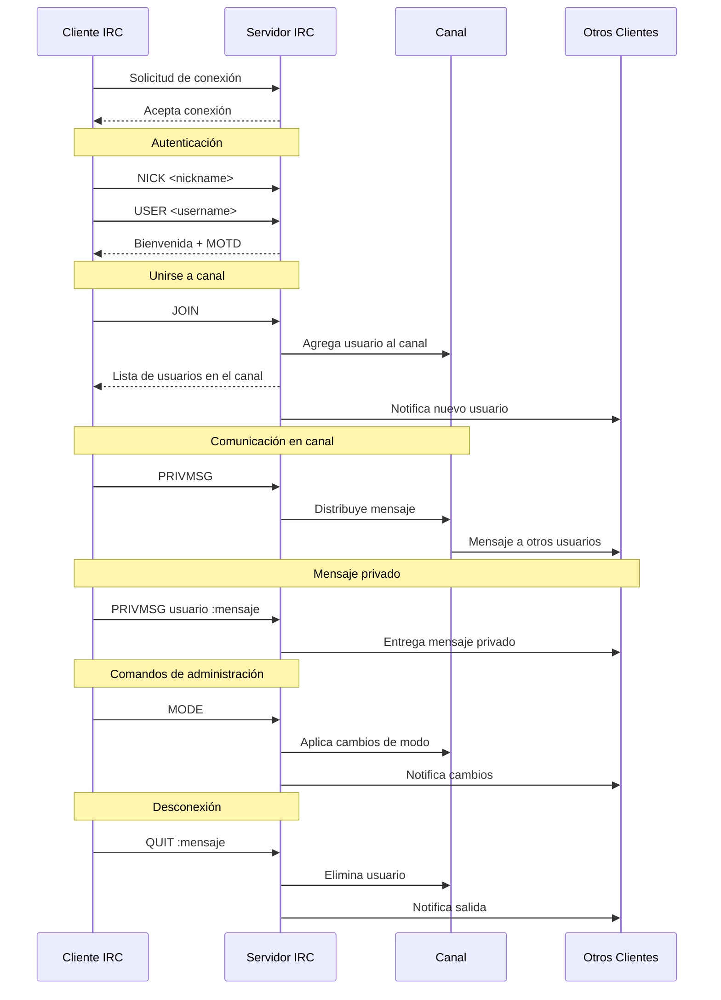
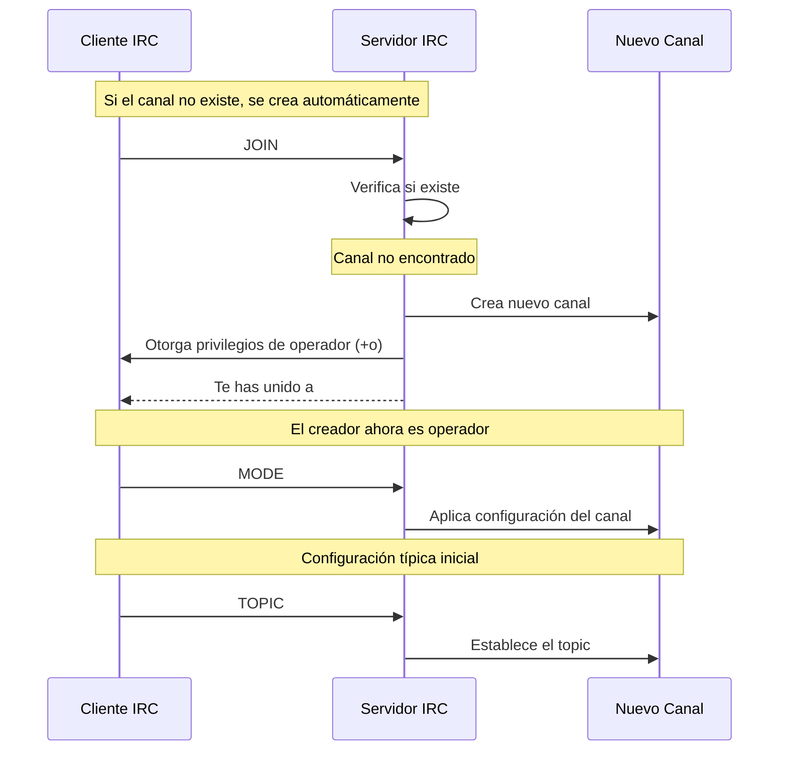

# Table of Contents
1. [Cómo testear](#cómo-testear)
2. [TODO](#todo)
3. [Flujos](#flujos)
	1. [Flujo de Interacción](#flujo-de-interacción)
	2. [Flujo de Creación de Canal](#flujo-de-creación-de-canal)


## Cómo testear

```bash
make
./ircserv 6667 password
```

En otra terminal, conectate con irssi:

```bash
irssi
```
Y conéctate al servidor:
```bash
/connect 127.0.0.1 6667
```

Juega con el servidor!

## TODO

### Carlos: Gestión de Clientes y Autenticación
**Enfoque**: Manejo de conexiones de clientes y toda la lógica de autenticación/registro

1. **Client & Authentication**:
```cpp
// Archivos principales:
- Client.hpp/cpp         // Ya iniciado
- Authentication.hpp/cpp // Nuevo
- Responses.hpp/cpp      // Nuevo
```

**Responsabilidades**:
- Conexión/desconexión de clientes
- Proceso de autenticación (PASS, NICK, USER)
- Gestión de nicknames únicos
- Formateo de respuestas IRC
- Comandos principales:
  * CAP
  * PASS
  * NICK
  * USER
  * QUIT

**Puntos clave**:
- Mantener registro de clientes conectados
- Validar credenciales
- Manejar colisiones de nicknames
- Generar respuestas según protocolo IRC

### Juan: Gestión de Canales y Mensajes
**Enfoque**: Todo lo relacionado con canales y el envío de mensajes entre usuarios

```cpp
// Archivos principales:
- Channel.hpp/cpp     // Ya iniciado
- Message.hpp/cpp     // Ya iniciado
- CommandParser.hpp/cpp // Nuevo
```

**Responsabilidades**:
- Gestión de canales
- Parsing de mensajes
- Modos de canal (i,t,k,o,l)
- Comandos principales:
  * JOIN
  * PRIVMSG
  * KICK
  * INVITE
  * TOPIC
  * MODE

**Puntos clave**:
- Manejo de permisos de canal
- Broadcast de mensajes
- Parse de comandos
- Gestión de operadores

### Archivos Compartidos
```cpp
- IRC.hpp       // Definiciones comunes
- Server.hpp/cpp // Lógica central, se desarrolla conjuntamente
```

### Flujo de Trabajo Sugerido

1. **Fase 1: Infraestructura Básica**
   - Carlos: Implementación básica de Client y autenticación
   - Juan: Implementación básica de Channel y parsing de mensajes

2. **Fase 2: Comandos Básicos**
   - Carlos: PASS, NICK, USER
   - Juan: JOIN, PRIVMSG

3. **Fase 3: Funcionalidades Avanzadas**
   - Carlos: Gestión de usuarios y respuestas
   - Juan: Modos de canal y comandos de operador

4. **Fase 4: Integración y Testing**
   - Ambos: Testing con irssi
   - Ambos: Refinamiento de la integración

### Puntos de Sincronización
1. **IRC.hpp**: Definiciones compartidas
2. **Server.cpp**: Punto de integración principal
3. **Testing**: Pruebas conjuntas con irssi

## Flujos

### Flujo de Interacción



### Flujo de Creación de Canal

